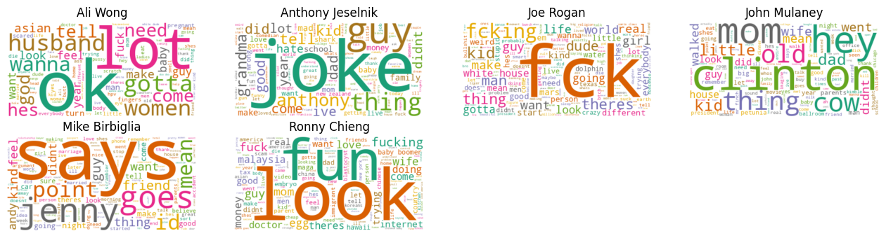

# standup-nlp-portfolio

Hi! I’m **Armandeep Singh Dhillon** ([@dhillonarman](https://github.com/dhillonarman) · he/him).  
This repository is my end-to-end NLP showcase using stand-up comedy transcripts. It demonstrates data cleaning, EDA, sentiment analysis, topic modeling, and text generation—all in a clear, professional workflow.

---

## 📁 Repository Structure

standup-nlp-portfolio/
├── notebooks/
│ ├── 01_data_cleaning_transformation.ipynb
│ ├── 02_eda.ipynb
│ ├── 03_sentiment_analysis.ipynb
│ ├── 04_text_generation.ipynb
│ └── 05_topic_modelling.ipynb
├── data/
│ └── raw/ # Raw transcript files
│ └── cleaned/ # Cleaned text files
├── images/ # Screenshots & visualization samples
│ ├── wordcloud_example.png
│ └── sentiment_distribution.png
├── requirements.txt
└── README.md

yaml
Copy
Edit

---

## 🚀 Project Overview

I collected and cleaned transcripts from popular stand-up comedians, then applied:

1. **Data Cleaning & Transformation**  
   • Web-scrape and parse raw transcripts  
   • Normalize text, remove HTML/noise  
   • Export clean `.txt` files  

2. **Exploratory Data Analysis (EDA)**  
   • Word counts, unique vocabulary size  
   • Word clouds & frequency plots  
   • Profanity & lexical diversity comparisons  

3. **Sentiment Analysis**  
   • Polarity & subjectivity with TextBlob  
   • Per-comedian and per-segment sentiment trends  
   • Visualize sentiment over time  

4. **Text Generation**  
   • Markov chain model trained on one transcript  
   • Generate “new” lines in comedian’s style  

5. **Topic Modeling**  
   • LDA with Gensim to extract thematic topics  
   • Experiment with different topic counts  
   • Visualize top words per topic  

---

## 📊 Key Visualizations

<!-- Replace these with your actual exported images -->
### Word Cloud Example  


### Sentiment Distribution  


---

## ⚙️ Setup & Installation

1. **Clone the repo**  
   ```bash
   git clone https://github.com/dhillonarman/standup-nlp-portfolio.git
   cd standup-nlp-portfolio
Create & activate a virtual environment

venv (pip)

bash
Copy
Edit
python3 -m venv env
source env/bin/activate      # Windows: .\env\Scripts\activate
conda

bash
Copy
Edit
conda create -n nlp-env python=3.8
conda activate nlp-env
Install dependencies

bash
Copy
Edit
pip install -r requirements.txt
NLTK/TextBlob corpora

bash
Copy
Edit
python -m textblob.download_corpora
▶️ Running the Notebooks
Launch Jupyter:

bash
Copy
Edit
jupyter notebook
Open any notebook in notebooks/, run all cells sequentially.

Each notebook loads cleaned data from data/cleaned and produces visuals/results in-line.

📜 requirements.txt
text
Copy
Edit
beautifulsoup4
gensim
jupyter
matplotlib
nltk
numpy
pandas
requests
scikit-learn
textblob
wordcloud
📝 (Optional) License
I’m happy to discuss licensing—feel free to add an MIT or other license if required.

Thank you for reviewing my work! If you have any questions, you can reach me via GitHub or LinkedIn.

Copy
Edit
